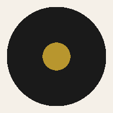
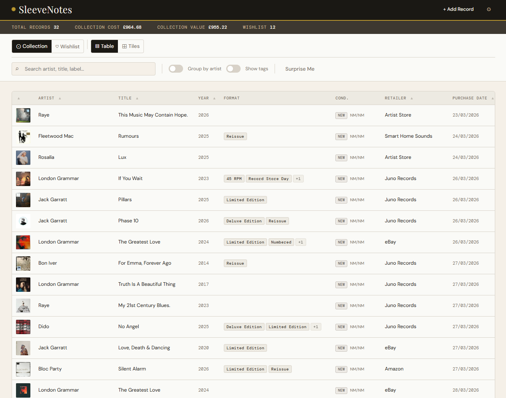
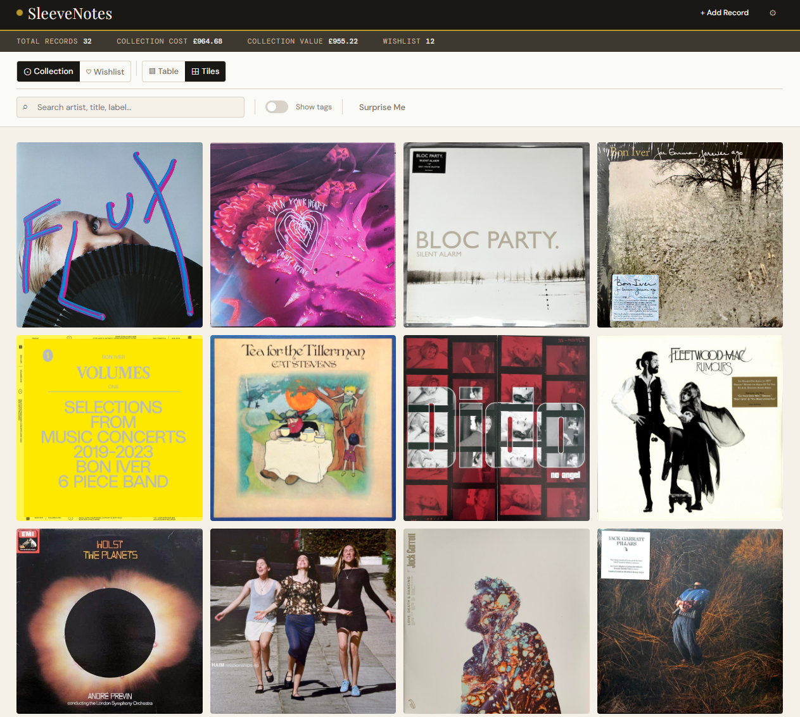
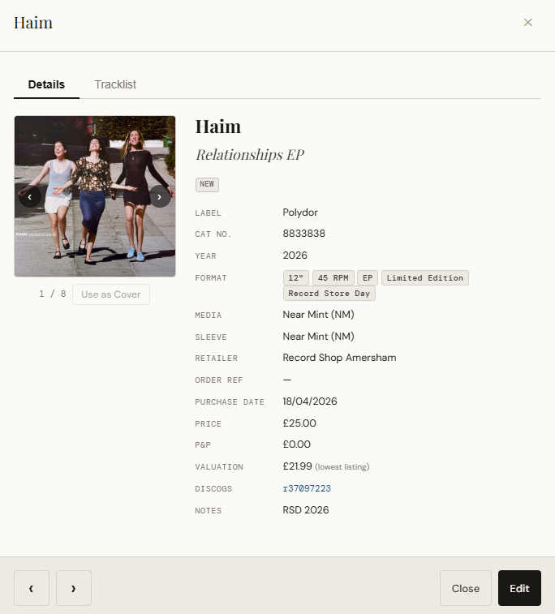
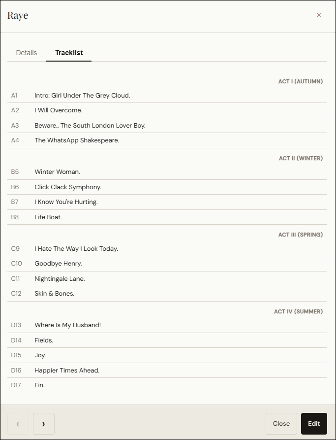
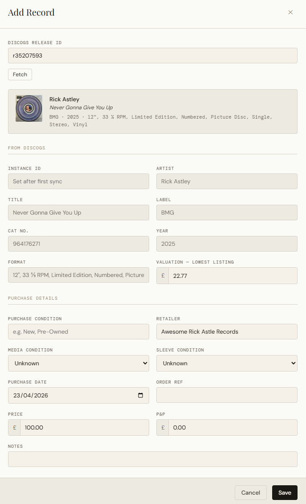
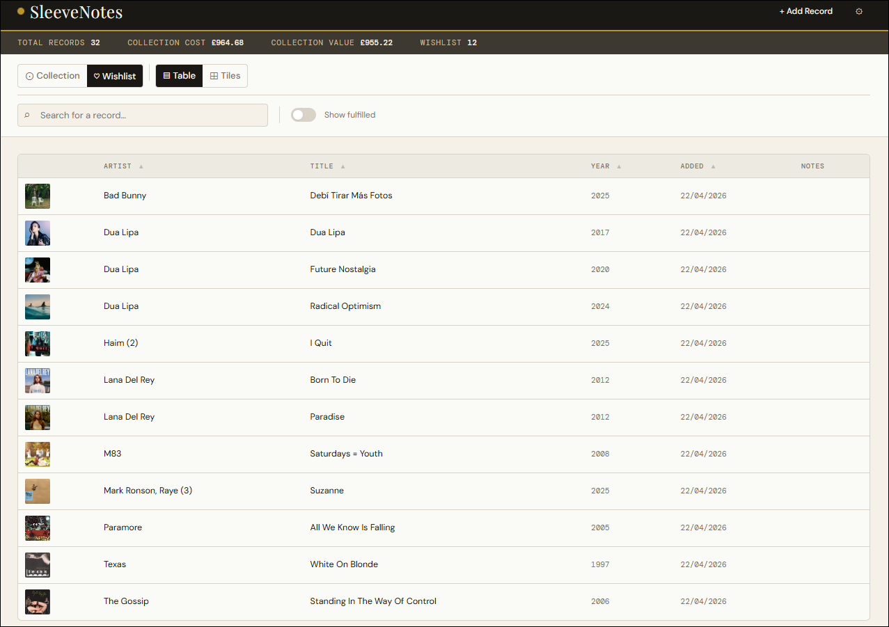
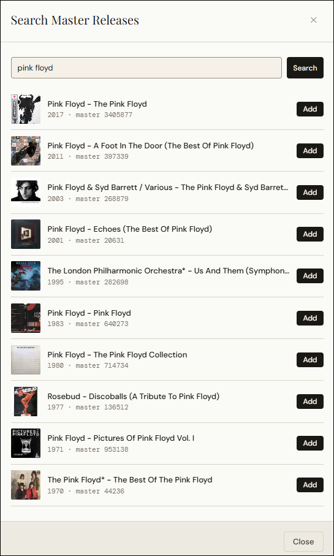

<h1> SleeveNotes</h1>

[](https://github.com/SiDtheTurtle/sleevenotes/releases/latest)
[](LICENSE)
[](https://github.com/SiDtheTurtle/sleevenotes/pkgs/container/sleevenotes)
[](https://claude.ai/code)

_A single page, locally hosted web app to track your vinyl collection._

## Introduction

I have a growing vinyl collection, and a growing home server setup to go with it. I wanted a simple app to track my collection and allow members of the household to add their wishlists, without having to navigate Discogs directly, or reach for the fantastic yet overkill other options out there, and to have something entirely local and not published out on the web. So inspired by [XKCD](https://xkcd.com/927/) I created my own!

SleeveNotes is a single page web app hosted in Docker that serves up a list of the records you own, and those you'd like to own. It has deep integration with Discogs; add the records manually or grab the Discogs ID from the page URL and add it to the app, it'll then sync the cover art, record details and so on to your collection. For wishlist items I wanted something where you could add the generic album, rather than specifying the exact edition, and SleeveNotes does just that; you add the 'master release' from Discogs, then when you find the exact release in the wild and add it to your collection, the wishlist item is fulfilled.

As a disclaimer I have a developer background but this was ripe for AI-assisted coding. This was built entirely through pair-programming with Claude Code. I made the design and architectural decisions, steered the AI to ensure there were no obvious security flaws and the UI was logical for humans, Claude Code did the typing.

---

## Screenshots

### The default view of your collection


### A large tile view alternative


### The detail view of each record


### The tracklist view of each record


### The dialog to add a record


### The wishlist view


### Adding to the wishlist


---

## Features

**Collection management**
- Add records manually or via Discogs release ID lookup
- Metadata pulled automatically: artist, title, label, catalogue number, year, format, cover art, tracklist
- Track purchase details: retailer, order reference, price, P&P, condition (media and sleeve), and notes
- Current market valuation sourced from the Discogs marketplace (lowest listing price)
- Soft-delete with full data preservation

**Searching**
- Free text search
- Filter by tags

**Views**
- Table view with sortable columns and optional artist grouping
- Tile view — cover art grid sorted by artist then year

**Wishlist**
- Search Discogs for master releases and add to a personal wishlist
- Mark items fulfilled when you acquire them
- Works offline — searches and additions queue locally and sync when the server is back

**Import / export**
- Bulk import from your Discogs collection
- Import from a Discogs-format CSV
- Export to CSV (all fields, compatible with re-import, so you can take your data wherever you like)

**Offline support**
- Collection and wishlist readable when you're not at home
- Add to your wishlist as long as you have an Internet connection

---

## Getting Started

### Prerequisites

- [Docker](https://docs.docker.com/get-docker/)
- A [Discogs account](https://www.discogs.com) (free) — required for metadata lookups and collection sync
- A [Discogs Personal Access Token](https://www.discogs.com/settings/developers) — generated in your Discogs developer settings under *Personal Access Tokens*

### Installation

1. Create a `compose.yml` file with the following contents:
   ```yaml
   services:
     sleevenotes:
       image: ghcr.io/sidtheturtle/sleevenotes:latest
       container_name: sleevenotes
       ports:
         - "2026:2026"
       volumes:
         - data:/data
       restart: unless-stopped

   volumes:
     data:
       name: sleevenotes_data
   ```

2. Start the container:
   ```bash
   docker compose up -d
   ```

3. Open your browser and navigate to:
   ```
   http://[server]:2026
   ```
   Replace `[server]` with `localhost` if running locally, or the hostname/IP of the machine running Docker.

Data is stored in a Docker volume (`sleevenotes_data`) and persists across restarts.

### Initial setup

1. Open **Settings** (gear icon, top right).
2. Under **Discogs**, enter your username and Personal Access Token.
3. Optionally configure display preferences: clean artist names (removes the bracketed numbers after some artists' names), hide obvious tags like vinyl and LP, show or hide how much you've spent on records that could have gone on food or rent, and more.
4. If you track purchase details in Discogs custom fields — **retailer, order reference, purchase date, price, P&P, or new/pre-owned status** — set those up in your Discogs collection first, then map them to SleeveNotes fields under **Settings → Discogs → Field Mapping**. Without this, those fields won't be populated on sync or CSV import.

---

## Importing your collection

There are two ways to get your existing collection into SleeveNotes.

### Discogs collection sync

The recommended path if your collection is already on Discogs.

1. Ensure your Discogs username is set in **Settings → Discogs**.
2. Open **Settings → Discogs → Sync Collection**.
3. SleeveNotes fetches your full Discogs collection and shows a diff — new records, updated records, and records only in SleeveNotes.
4. Review and apply. You can choose to sync to SleeveNotes, push changes back to Discogs, or both.

After syncing, SleeveNotes fetches cover art, tracklists, and valuations for new records in the background. Covers appear as they download — the view refreshes automatically.

### CSV import

Use this if you have a Discogs export CSV, or a CSV previously exported from SleeveNotes.

1. Open **Settings → Data → Import from CSV**.
2. Select your file. SleeveNotes shows a diff preview before applying any changes.
3. Review and confirm.

Records not present in the CSV are left untouched — CSV import is additive and non-destructive.

---

## Wishlist

The wishlist tracks master releases you want to acquire, separate from your collection, and doesn't require you to find a specific release from Discogs.

### Adding items

1. Switch to the **Wishlist** section from the top nav.
2. Use the search bar (or press Enter) to open the master release search.
3. Search by artist or title — results come from the Discogs master release catalogue.
4. Click **Add** on any result. SleeveNotes fetches full metadata and cover art and adds the item to your wishlist.

### Fulfilling a wishlist item

When you add a record to your collection via Discogs ID lookup, SleeveNotes checks whether the release matches anything on your wishlist. If it does, you'll be prompted to mark the wishlist item as fulfilled. Any notes on the wishlist item are appended to the new collection record automatically.

You can also mark items fulfilled (or un-fulfil them) directly from the wishlist detail view.

### Offline behaviour

Wishlist search and adding records works when the server is unreachable. Items added offline are queued locally and appear immediately with a **Pending** badge. They are submitted to the server automatically when the connection is restored.

---

## Offline behaviour

SleeveNotes distinguishes two offline states:

| State | Cause | What works |
|---|---|---|
|  | No internet connection | Browse collection and wishlist from cache; no writes |
|  | Internet available, but server unreachable | Browse from cache; wishlist search, add, and edit queue locally |

In both states, collection writes (add, edit, delete records) are disabled. The app detects reconnection automatically and flushes any queued wishlist changes.

---

## PWA — installing the app

SleeveNotes is a Progressive Web App. On supported browsers you can install it to your home screen or taskbar and use it like a native app — offline browsing included.

**Note:** PWA installation requires the app to be served over HTTPS from a real domain. A local `http://localhost` setup will not prompt for installation. If you're self-hosting on a local network with a domain and TLS certificate, installation will work as expected.

To install:
- **Android (Chrome):** tap the browser menu → *Add to Home Screen*
- **iOS (Safari):** tap the share icon → *Add to Home Screen*
- **Desktop (Chrome/Edge):** click the install icon in the address bar

---

## Maintenance

### Resetting the database

Deletes all records. Settings are preserved.

```bash
docker exec sleevenotes rm /data/sleevenotes.db
docker compose restart
```

The schema is recreated automatically on next request.

Alternatively, use **Settings → Danger Zone → Delete All Records** to clear records without touching the container, or **Format Database** for a full factory reset (records + settings).

### Clearing the image cache

Cover art is cached locally in the Docker volume. To free disk space:

```bash
docker exec sleevenotes rm -rf /data/images/
```

Or use **Settings → Danger Zone → Clear Image Cache** from within the app.

---

## Tech stack

| Layer | Technology |
|---|---|
| Backend | Python 3.12, FastAPI, SQLite |
| Frontend | Vanilla JS SPA — no framework, no build step |
| Container | Docker |
| Metadata | [Discogs API](https://www.discogs.com/developers) |

---